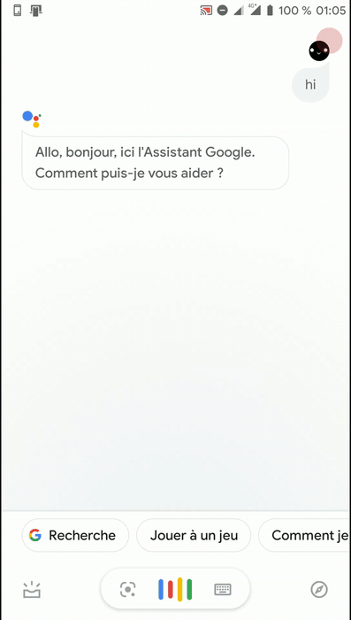
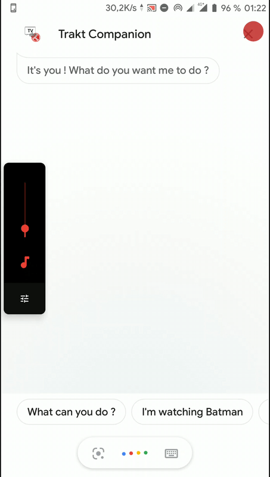
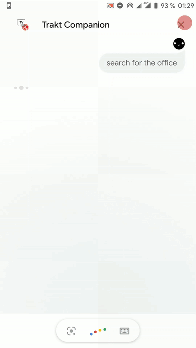

Note - This was started in 2018 as a learning project and needs quite a few refactorisations :) .

### Context and motivations
[Trakt.tv](http://trakt.tv) is one of the various services offering to remember your TV shows & movies, 
the ones you watched, the ratings you gave, but also those still in your watchlist.

One of the main features of the website is the "Check-in" : 
It sets your account status as "Currently watching _*the movie/show you are watching*_",
eventually broadcasts this information on social media if you chose to, and adds it to your "Watch history" with the correct date and time.

It is basically what you do just before the movie starts at the theater, or on the couch at home with your friends or family.

But it is not such a fast process - you have to find your phone, open the browser on the Trakt.tv website, login, 
search and find the movie you're about to watch, and finally check in !
Add that with the usual poor network in theaters, or your surroundings, and it's easy to give up this routine. 

At home, with Voice Enabled assistants, a few sentences would be enough to do all that, or eventually a quick text on a phone assistant.

The [Actions on Google](https://developers.google.com/assistant) platform allows any developer 
to make an chatbot available through talking with the Google Assistant and the various surface it is available on.

It seemed to be quite a good match for starting this project, starting with the "Check-in" functionality, 
and before eventually extending it to more platforms and features.

### Usage

The app is not reviewed by Google so it is not public, but one could say or write "Talk to Trakt Companion" in any Google Assistant client. A phone, a voice assistant, a smart screen, anything.

Currently, it can search for movies/shows, choose the most relevant one automatically if needed, "check-in" to a movie/episode, and cancel active check-ins. 

 When asking to check-in, the safest way is to indicate any needed informations, such as "Check-in the first episode of the second season of Game of Thrones" or "I'm watching the Batman movie". But in the absence of such informations, the bot tries to take its best guess regarding the type of media (show/movie) and asks an episode number later on if needed.

### Mini-demos








#### Fulfillment for DialogFlow

This project has two parts. This one, which is a fullfillment webhook, intended to be used along with [Dialogflow](https://dialogflow.com/). 
Dialogflow has NLP capabilities just like [wit.ai](http://wit.ai), and is able to recognize intents and entities we define.
It also provides multiple integration channels.

Google Assistant is one of these, and this project was made with Google Assistant in mind,
so that it could be used both writing or talking to a phone or voice-enabled assistant.

The other part is the one on DialogFlow, where I defined relevants Intents and entities, along with training the model.
For now, I won't go into more details with Dialogflow in this readme.
 
#### Account linking with Actions On Google (AoG)

Google offers on its platform an [account linking](https://developers.google.com/assistant/identity/google-sign-in-oauth) feature,
allowing the user to be seamlessly associated to his trakt account.

We can then proceed with API requests with the obtained short-lived user token Google provides us on the behalf of the user.

To achieve this, a Trakt.tv API App has to be created on Trakt.tv, and the client id & secret have to be entered into AoG, the project settings. 


### Deployment & Hosting of the Fulfillment webhook

The webhook is hosted on my firebase project plan. To test it, you can host one locally or host it as well.

#### Prerequisites
0. Create a Firebase project in the [Firebase console](https://firebase.google.com/console). 

    Then, in the project directory, execute the following with a command prompt.

0. Install Firebase CLI with `npm install -g firebase-tools`. It might be needed to run this one with administrator privileges.

0. Install the package dependencies with `npm install`

0. Create a Firebase project in the [Firebase console](https://firebase.google.com/console)

0. Authenticate to the Firebase CLI through `firebase login`

0. Run `firebase init functions` to initialize the project

0. Create an account and client app on [staging.Trakt.tv](http://staging.trakt.tv), and take note of your client Id.

    [staging.Trakt.tv](http://staging.trakt.tv) is an endpoint used for testing, to avoid filling the main site with test data.
    If you are ready to use this on production, you can create the app on [Trakt.tv](http://trakt.tv) instead. 

0. To gather poster images for shows and movies, we have to use another service like TMDB, since the Trakt API doesn't provide images.
    Create a TMDB account and obtain an [API key](https://www.themoviedb.org/settings/api) 

0. Set the required environment variables, like so :

    `firebase functions:config:set TMDB.apiKey="TMDBApiKey" traktclient.id="ClientId" traktclient.endpoint="https://api-staging.trakt.tv"`
    (or `"api.trakt.tv"` if using the main trakt website.)


#### Deploy and use 

- With `npm run serve` the project can be locally deployed. 

    In that case, have a tool ready for proxying the connexion through an HTTPS proxy, as per Dialogflow's guidelines requiring a HTTPS webhook.
    I recommend [ngrok](http://ngrok.com) . Take note of the https endpoint given to you.
    
    It is also needed to write the functions configuration variables beforehand, with 
    ```
       firebase functions:config:get > .runtimeconfig.json
       # If using Windows PowerShell, replace the above with:
       firebase functions:config:get | ac .runtimeconfig.json
  ```

- With `npm deploy` the project can be deployed to firebase functions hosting.

    In order to use this, it requires a billable firebase account, on a paid plan. 
    As mentioned in the [Firebase Pricing page](https://firebase.google.com/pricing), the free _Spark plan_ denies any requests to outbound services, such as Trakt.tv . 

    The "pay as you go" _Blaze plan_ includes a reasonable 5GB outbound data transfer for free, but still requires bank information to sign up for, as any use after the free quota will be billed. 
